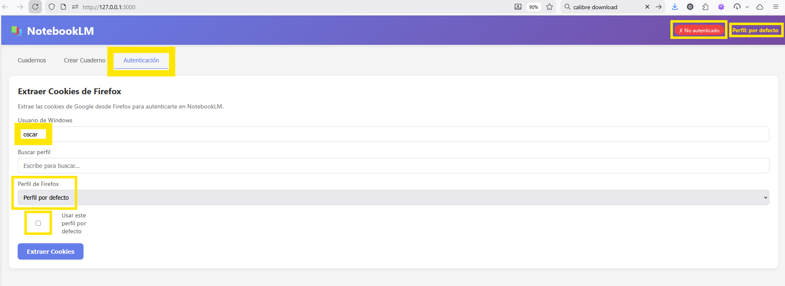
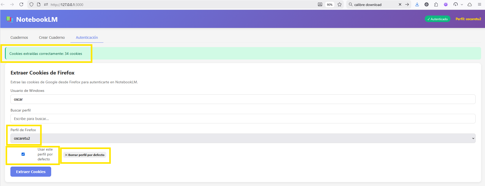
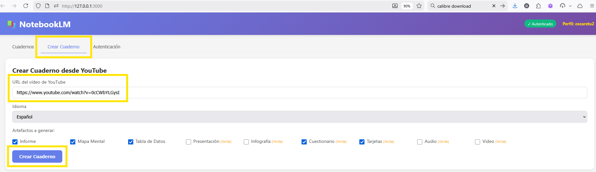
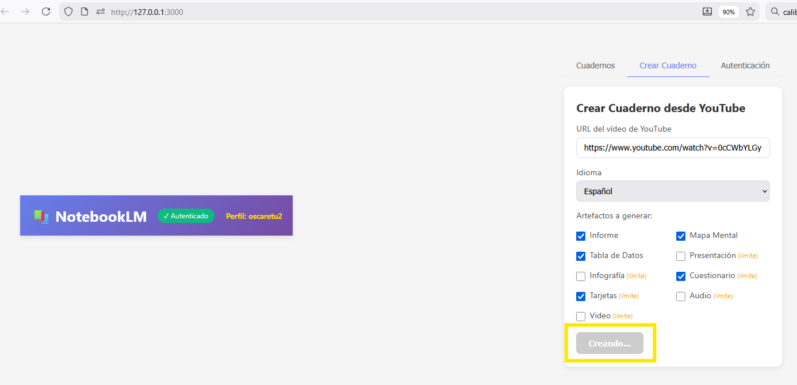

# NotebookLM Tools

Command line tools and web interface to automate Google NotebookLM tasks.

## Web Interface (New)

Also available as a web application with React frontend:

### Run

```bash
# Backend (terminal 1)
cd backend
pip install -r requirements.txt
python -m uvicorn app.main:app --reload --port 8000

# Frontend (terminal 2)
cd frontend
npm install
npm run dev
```

Available at: **http://localhost:3000**

### Web Interface Features

- View notebook list with search and sorting (newest first)
- Create new notebooks from YouTube
- View details of each notebook with all artifacts
- **View notebook summary** generated by NotebookLM
- **Copy notebook summary** to clipboard
- **View reports in HTML** with markdown copy option
- **Download reports as Markdown** with blockquote header (title + URL)
- Download videos, audios, presentations and infographics
- Extract Firefox cookies directly from the interface
- **Predictive Firefox profile search**
- **Save default profile** (persists in browser)
- **Bookmarklet** to create notebooks directly from YouTube

### Screenshots


*Authentication settings*


*Cookie extraction from Firefox*


*Form to create a new notebook*


*Result after creating the notebook*

### Bookmarklet

Create a bookmark in your browser with the following code:

```javascript
javascript:(function(){window.open('http://localhost:3000/#/create?url='+encodeURIComponent(window.location.href),'_blank');})()
```

When viewing a YouTube video, click the bookmark to open the notebook creation interface with the video URL pre-filled.

---

## Prerequisites

### Installation

```bash
pip install -r requirements.txt
playwright install chromium
```

Main dependencies:
- `notebooklm-py`: Unofficial NotebookLM API client
- `yt-dlp`: YouTube metadata extraction
- `rich`: Visual CLI library (tables, progress bars)

> **IMPORTANT**: Keep `yt-dlp` updated. YouTube frequently changes its API and older versions may fail with "400 Bad Request" or "Precondition check failed" errors. Update with:
> ```bash
> pip install --upgrade yt-dlp
> ```

For the Bash script you also need:
```bash
# jq for JSON parsing
sudo apt install jq  # Linux/WSL
brew install jq      # macOS
```

### Authentication

There are two ways to authenticate:

#### Option 1: Standard login (opens browser)

```bash
notebooklm login
```

A browser will open. Sign in and wait for the NotebookLM main page, then press ENTER in the terminal.

#### Option 2: Extract Firefox cookies (recommended for WSL2)

If you already have Firefox open with an active Google session, you can extract cookies without logging in again:

```bash
python extraer_cookies_firefox.py
```

This is especially useful in WSL2, where Firefox is installed on Windows but you run the scripts from Linux.

List available Firefox profiles:
```bash
python extraer_cookies_firefox.py --listar-perfiles
```

Use a specific profile:
```bash
python extraer_cookies_firefox.py --perfil Susana
```

Verify authentication works:
```bash
notebooklm auth check --test
```

**Supported platforms**: WSL2, Windows (PowerShell), Linux, macOS (auto-detects).

Credentials are stored in `~/.notebooklm/storage_state.json`.

---

## Visual Features (New)

Python scripts now use the **Rich** library for a better user experience:
- **Formatted tables**: Clear artifact status display.
- **Progress bars**: Real-time visualization of artifact generation.
- **Spinners**: Visual indicators for waiting operations (connections, downloads).
- **Colors**: Success (green), error (red), and warning (yellow) messages easily distinguishable.

## Available Tools

| Tool | Description | Language |
|------|-------------|----------|
| `main.py` | Create notebooks with selectable artifacts | Python |
| `ver_cuaderno.py` | Query and manage existing notebook artifacts | Python |
| `crear_cuaderno.sh` | Create notebooks (simplified version) | Bash |
| `listar_cuadernos.py` | List available notebooks | Python |
| `listar_cuadernos_como_JSON_ordenados_por_fecha.sh` | List notebooks as JSON | Bash |
| `extraer_cookies_firefox.py` | Extract Firefox cookies for authentication | Python |

---

## NotebookLM Quotas

NotebookLM has daily limits for certain artifact types:

| Artifact | Daily Limit |
|---------|-------------|
| Report (Briefing Doc) | No limit |
| Mind Map | No limit |
| Audio (Podcast) | **Limited** |
| Video | **Limited** |
| Presentation (Slides) | **Limited** |
| Infographic | **Limited** |
| Quiz | **Limited** |
| Flashcards | **Limited** |

If you hit the limit, wait until the next day or subscribe to NotebookLM Plus.

---

## main.py - Create Notebooks from YouTube Videos (Python)

Version: **0.8.0**

Automatically creates a notebook in NotebookLM from a YouTube video. By default generates: report, mind map, data table, quiz, and flashcards.

### Basic Usage

```bash
python main.py <YOUTUBE_URL>
```

### Parameters

| Parameter | Description | Default |
|-----------|-------------|---------|
| `url` | YouTube video URL (required) | - |
| `--idioma` | Language code for artifacts | `es` |
| `--mostrar-informe` | Display report content on screen | No |
| `--mostrar-descripcion` | Display YouTube video description | No |
| `--timeout-fuente` | Max seconds to wait for source processing | `60` |
| `--retardo` | Seconds delay between each generation start | `3` |
| `--debug` | Enable detailed execution traces | No |
| `--version`, `-v` | Show program version | - |

### Artifact Options

| Option | Description | Limit |
|--------|-------------|-------|
| (none) | Only generates report | No |
| `--report` | Generate report | No |
| `--audio` | Generate audio summary | Yes |
| `--slides` | Generate presentation | Yes |
| `--infographic` | Generate infographic | Yes |
| `--todo` | Generate all artifacts | Mixed |

### Usage Examples

```bash
# Default artifacts (report, mind map, table, quiz, flashcards)
python main.py "https://www.youtube.com/watch?v=VIDEO_ID"

# All artifacts
python main.py "https://www.youtube.com/watch?v=VIDEO_ID" --todo

# Only audio, slides and quiz
python main.py "https://www.youtube.com/watch?v=VIDEO_ID" --audio --slides --quiz

# View video description
python main.py "https://www.youtube.com/watch?v=VIDEO_ID" --mostrar-descripcion

# Create notebook in English
python main.py "https://www.youtube.com/watch?v=VIDEO_ID" --idioma en

# Run with debug mode
python main.py "https://www.youtube.com/watch?v=VIDEO_ID" --debug
```

### Quota Limit Handling

The script detects when the daily limit is reached and shows a clear message:

```
[12:30:45] ⚠ Presentation (Slides): Daily limit reached
           Wait until tomorrow or subscribe to NotebookLM Plus
[--:--:--] ⏭ Infographic: Skipped (shared quota exhausted)
```

Presentations and infographics share quota; if one fails due to limit, the other is automatically skipped.

---

## ver_cuaderno.py - Query and Manage Existing Notebook Artifacts

Version: **0.1.0**

Allows querying the status of an existing notebook in NotebookLM and optionally generating missing artifacts. Accepts a NotebookLM URL or notebook ID directly.

### Basic Usage

```bash
# Query status (without generating anything)
python ver_cuaderno.py <URL_OR_ID>
```

### Parameters

| Parameter | Description | Default |
|-----------|-------------|---------|
| `notebook` | NotebookLM URL or notebook ID (required) | - |
| `--idioma` | Language code for filtering/generating artifacts | `es` |
| `--mostrar-informe` | Display report content on screen | No |
| `--retardo` | Seconds delay between each generation start | `3` |
| `--debug` | Enable detailed execution traces | No |
| `--version`, `-v` | Show program version | - |

### Artifact Options

| Option | Description | Limit |
|--------|-------------|-------|
| (none) | Only queries, generates nothing | - |
| `--report` | Generate report | No |
| `--audio` | Generate audio summary | Yes |
| `--slides` | Generate presentation | Yes |
| `--infographic` | Generate infographic | Yes |
| `--todo` | Generate all missing artifacts | Mixed |

### Usage Examples

```bash
# Query status with full URL
python ver_cuaderno.py "https://notebooklm.google.com/notebook/NOTEBOOK_ID"

# Query status with direct ID
python ver_cuaderno.py "NOTEBOOK_ID"

# Generate all missing artifacts
python ver_cuaderno.py "NOTEBOOK_ID" --todo

# Generate only audio, slides and quiz
python ver_cuaderno.py "NOTEBOOK_ID" --audio --slides --quiz

# View report content
python ver_cuaderno.py "NOTEBOOK_ID" --mostrar-informe

# Query artifacts in English
python ver_cuaderno.py "NOTEBOOK_ID" --idioma en

# Run with debug mode
python ver_cuaderno.py "NOTEBOOK_ID" --debug
```

---

## crear_cuaderno.sh - Create Notebooks (Bash)

Version: **1.3.0**

Simplified Bash version that uses the `notebooklm` CLI directly. By default only generates artifacts without quota limits.

### Basic Usage

```bash
./crear_cuaderno.sh <YOUTUBE_URL> [options]
```

### Options

| Option | Description | Limit |
|--------|-------------|-------|
| (none) | Generates Report and Mind Map | No |
| `--audio` | Add podcast | Yes |
| `--video` | Add video | Yes |
| `--slides` | Add presentation | Yes |
| `--infographic` | Add infographic | Yes |
| `--quiz` | Add quiz | Yes |
| `--flashcards` | Add flashcards | Yes |
| `--todo` | Generate all artifacts | Mixed |
| `--solo-limite` | Only limited artifacts | Yes |
| `--mostrar-descripcion` | Show video description | - |
| `-h`, `--help` | Show help | - |

### Usage Examples

```bash
# Only unlimited artifacts (report + mind-map)
./crear_cuaderno.sh "https://www.youtube.com/watch?v=VIDEO_ID"

# Add podcast
./crear_cuaderno.sh "https://www.youtube.com/watch?v=VIDEO_ID" --audio

# Add presentation and infographic
./crear_cuaderno.sh "https://www.youtube.com/watch?v=VIDEO_ID" --slides --infographic

# Generate all artifacts
./crear_cuaderno.sh "https://www.youtube.com/watch?v=VIDEO_ID" --todo

# View video description
./crear_cuaderno.sh "https://www.youtube.com/watch?v=VIDEO_ID" --mostrar-descripcion
```

### Additional Requirements

- `notebooklm` CLI installed and authenticated
- `yt-dlp` for video metadata
- `jq` for JSON parsing

---

## listar_cuadernos.py - List Available Notebooks

Shows all notebooks in your NotebookLM account with sorting options.

### Basic Usage

```bash
python listar_cuadernos.py
```

### Parameters

| Parameter | Description | Default |
|-----------|-------------|---------|
| `--ordenar` | Sort field: `nombre`, `creacion`, `modificacion` | `nombre` |
| `--desc` | Descending order | ascending |
| `--idioma` | Filter by artifact language (e.g., `es`, `en`) | none |

**Note**: The `--idioma` option currently doesn't work correctly because the NotebookLM API doesn't expose artifact language. The `--ordenar modificacion` option also doesn't work because the API only provides creation date.

### Usage Examples

```bash
# List by name (A-Z)
python listar_cuadernos.py

# List by name (Z-A)
python listar_cuadernos.py --ordenar nombre --desc

# List by creation date (newest first)
python listar_cuadernos.py --ordenar creacion --desc
```

### Bash Alternative (JSON)

```bash
./listar_cuadernos_como_JSON_ordenados_por_fecha.sh
```

Returns the notebook list in JSON format sorted by creation date (newest first).

---

## Download Artifacts with notebooklm

Python scripts show ready-to-copy download commands. You can also use these commands manually:

### Download Reports

```bash
# Download the latest report
notebooklm download report -n NOTEBOOK_ID

# Download to a specific file
notebooklm download report -n NOTEBOOK_ID "My_Report.md"

# Download all reports to a directory
notebooklm download report -n NOTEBOOK_ID --all ./reports/

# Download a specific report by ID
notebooklm download report -n NOTEBOOK_ID -a ARTIFACT_ID "Report_Name.md"
```

### Download Other Artifacts

```bash
# Audio (podcast)
notebooklm download audio -n NOTEBOOK_ID -a ARTIFACT_ID "Podcast.mp4"

# Video
notebooklm download video -n NOTEBOOK_ID -a ARTIFACT_ID "Video.mp4"

# Presentation (slides)
notebooklm download slide-deck -n NOTEBOOK_ID -a ARTIFACT_ID "Presentation.pdf"

# Infographic
notebooklm download infographic -n NOTEBOOK_ID -a ARTIFACT_ID "Infographic.png"

# Mind Map
notebooklm download mind-map -n NOTEBOOK_ID -a ARTIFACT_ID "MindMap.png"

# Quiz
notebooklm download quiz -n NOTEBOOK_ID -a ARTIFACT_ID "Quiz.json"

# Flashcards
notebooklm download flashcards -n NOTEBOOK_ID -a ARTIFACT_ID "Flashcards.json"

# Data Table
notebooklm download data-table -n NOTEBOOK_ID -a ARTIFACT_ID "Table.csv"
```

### Common Options

| Option | Description |
|--------|-------------|
| `-n, --notebook` | Notebook ID |
| `-a, --artifact` | Specific artifact ID |
| `--latest` | Download the latest (default) |
| `--earliest` | Download the earliest |
| `--all` | Download all |
| `--name` | Filter by title (fuzzy match) |
| `--dry-run` | Preview without downloading |
| `--force` | Overwrite existing files |

### Export to Google Docs/Sheets

```bash
# Export report to Google Docs
notebooklm artifact export ARTIFACT_ID --title "My Report" --type docs

# Export quiz/flashcards/table to Google Sheets
notebooklm artifact export ARTIFACT_ID --title "My Data" --type sheets
```

---

## extraer_cookies_firefox.py - Extract Firefox Cookies for Authentication

Version: **1.0.0**

Extracts Google authentication cookies from Firefox and generates the `storage_state.json` file needed by notebooklm-py. This avoids running `notebooklm login` and is especially useful in WSL2.

### Advantages

- No need to log in again if you already have an active session in Firefox
- Firefox can remain open during extraction
- Cookies last longer because you share the session with your regular browser
- Works on WSL2, Windows, Linux, and macOS (auto-detects)

### Basic Usage

```bash
python extraer_cookies_firefox.py
```

### Parameters

| Parameter | Description | Default |
|-----------|-------------|---------|
| `--usuario`, `-u` | Windows/Linux/macOS username | `oscar` |
| `--perfil`, `-p` | Firefox profile name | `default-release` |
| `--output`, `-o` | Output file path | `~/.notebooklm/storage_state.json` |
| `--dry-run`, `-n` | Only show cookies, don't write file | No |
| `--verbose`, `-v` | Show detailed information | No |
| `--listar-perfiles`, `-l` | List available Firefox profiles | No |

### Usage Examples

```bash
# Use default profile
python extraer_cookies_firefox.py

# View available profiles
python extraer_cookies_firefox.py --listar-perfiles

# Use specific profile (accepts friendly or full name)
python extraer_cookies_firefox.py --perfil Susana
python extraer_cookies_firefox.py --perfil "kyetl4dz.Susana"

# Preview without writing file
python extraer_cookies_firefox.py --dry-run --verbose

# Verify authentication after extraction
notebooklm auth check --test
```

### How It Works

1. **Locates Firefox profile** based on platform (WSL2, Windows, Linux, macOS)
2. **Copies the cookies database** (Firefox can remain open)
3. **Filters Google cookies** needed for NotebookLM (~24 cookies)
4. **Generates the JSON file** in Playwright-compatible format

---

## Project Structure

```
crear_cuaderno_notebookLM_desde_video_YT/
├── backend/                                  # FastAPI - REST API
│   ├── app/
│   │   ├── api/                              # API endpoints
│   │   ├── services/                         # Business logic
│   │   └── main.py                           # Entry point
│   ├── requirements.txt                      # Python dependencies
│   └── tests/                                # Unit tests
├── frontend/                                 # React + Vite - Web interface
│   ├── src/
│   │   ├── App.jsx                           # Main component
│   │   ├── services/api.js                   # API client
│   │   └── index.css                         # Styles
│   ├── package.json
│   └── vite.config.js
├── common.py                                  # Shared module (CLI)
├── main.py                                    # Create notebooks from YouTube (Python)
├── ver_cuaderno.py                            # Query/manage existing notebooks (Python)
├── crear_cuaderno.sh                          # Create notebooks (Bash)
├── listar_cuadernos.py                        # List notebooks (Python)
├── listar_cuadernos_como_JSON_ordenados_por_fecha.sh  # List as JSON
├── extraer_cookies_firefox.py                 # Extract Firefox cookies
├── zzz_asigna_ubicacion_fichero_configuracion.inc.sh  # WSL2 config
├── requirements.txt                           # Python dependencies
├── CLAUDE.md                                  # Guide for Claude Code
├── README.md                                  # This documentation
└── .gitignore                                 # Ignored files
```

## Tool Comparison

| Aspect | main.py | ver_cuaderno.py | crear_cuaderno.sh |
|--------|---------|-----------------|-------------------|
| Input | YouTube URL | Notebook ID or URL | YouTube URL |
| Main function | Create notebook | Query/generate artifacts | Create notebook |
| Default artifacts | report, mind_map, data_table, quiz, flashcards | none (query only) | report, mind-map |
| Quota limits | Avoided by default | Avoided by default | Avoided by default |
| Language | Configurable (`--idioma`) | Configurable (`--idioma`) | Forced Spanish |
| Dependencies | Python + asyncio | Python + asyncio | Bash + jq |
| Shared quota | Detects and skips | Detects and skips | Not implemented |
| Shared module | `common.py` | `common.py` | - |

## Notes

- **Language**: The report and audio are generated in the specified language (Spanish by default).

- **Duplicate notebooks**: Scripts detect existing notebooks by video ID (prefix `YT-{video_id}`). If you run the script twice with the same video, it won't create a duplicate notebook.

- **NotebookLM Limits**:
  - 100 notebooks maximum
  - 50 sources per notebook
  - Daily limits on certain artifact generation

## Troubleshooting

### Authentication Error

```
Error: Missing required cookies: {'SID'}
```

Options:
1. Run `notebooklm login` and complete the authentication process
2. If you have Firefox with an active Google session, use `python extraer_cookies_firefox.py`

### Error in WSL2

If running from WSL2 with Firefox on Windows with an active session:
```bash
python extraer_cookies_firefox.py
```

Manual alternatives:
```bash
# Option 1: Helper script
source zzz_asigna_ubicacion_fichero_configuracion.inc.sh

# Option 2: Copy manually (if you used notebooklm login in PowerShell)
mkdir -p ~/.notebooklm
cp /mnt/c/Users/$USER/.notebooklm/storage_state.json ~/.notebooklm/
```

### Daily Limit Reached

```
⚠ Presentation (Slides): Daily limit reached
```

Options:
1. Wait until the next day
2. Subscribe to NotebookLM Plus
3. Use scripts without options (only generates unlimited artifacts)

### 403 Forbidden Error in yt-dlp

Use `--debug` to see details. 403 errors on some yt-dlp requests are normal and don't affect metadata extraction.
